<div align="center">


# Hydro — Water Reminder

**A calm, minimal water tracker for Android.**
Log a glass in one tap, get reminders only while you are awake, and keep your streak alive.


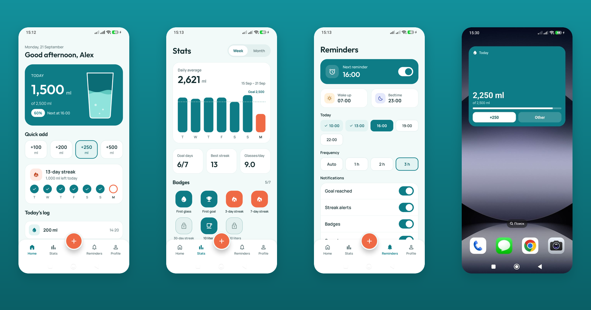

</div>

## Table of contents

- [Features](#features)
- [Demo](#demo)
- [Screenshots](#screenshots)
- [Tech stack](#tech-stack)
- [Architecture](#architecture)
- [Project structure](#project-structure)
- [Getting started](#getting-started)
- [Testing and quality](#testing-and-quality)
- [License](#license)

## Features

- **One-tap logging.** Quick-add cups on the Home screen, a custom amount sheet, and undo from the snackbar.
- **A personal daily goal.** Calculated from weight, age, gender and activity, and adjustable in 50 ml steps.
- **Smart reminders.** Spread across your waking hours, paused at night, and they stop once the goal is reached. Built on WorkManager, so they survive reboots without special permissions.
- **Stats.** Weekly and monthly charts, daily average, goal days, best streak and badges.
- **Streaks and badges.** First glass, first goal, 3/7/30-day streaks, 10 L and 100 L milestones.
- **Home screen widget.** Today's progress and a one-tap `+250 ml` button that works without opening the app.
- **Quick add from anywhere.** The same add-water dialog opens from the widget, the launcher shortcut and a Quick Settings tile.
- **Rich notifications.** Add water or snooze straight from the reminder, plus goal, streak and badge alerts.
- **Accounts.** Email/password or Google sign-in (Firebase Auth). Each account's data stays separate on the device.
- **Two languages.** English and Oʻzbekcha. You can switch in-app, and the app follows the system per-app language on Android 13+.
- **Private by design.** All tracking data lives in a local Room database, with no cloud database.

## Demo

<table>
  <tr>
    <th>App</th>
    <th>Widget</th>
    <th>Quick add from the widget</th>
  </tr>
  <tr>
    <td>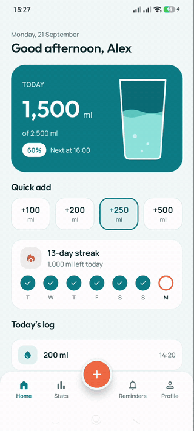</td>
    <td>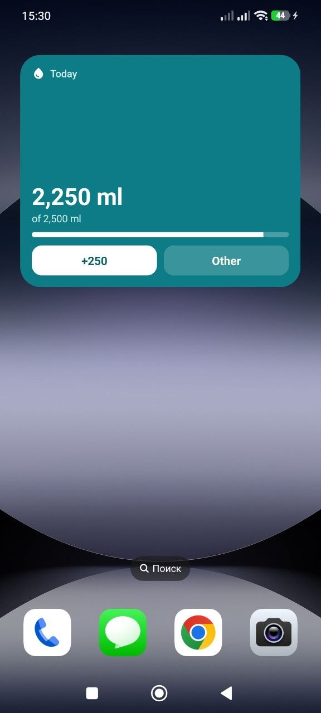</td>
    <td>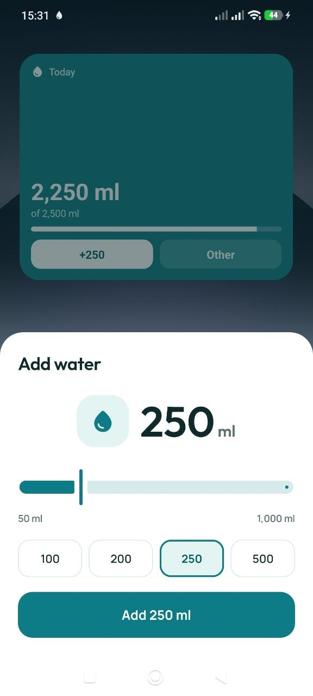</td>
  </tr>
</table>

## Screenshots

<table>
  <tr>
    <td align="center">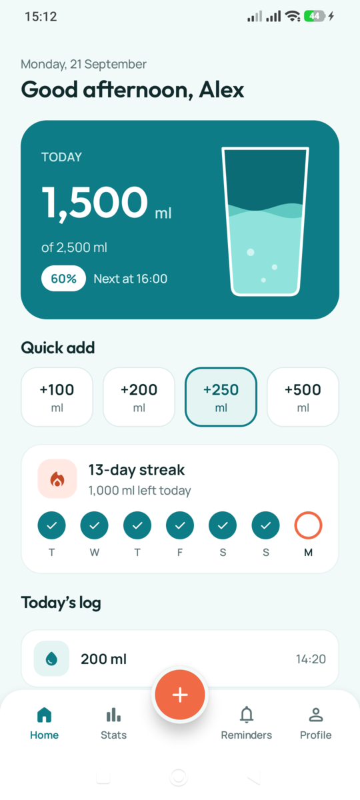<br /><sub><b>Home</b></sub></td>
    <td align="center">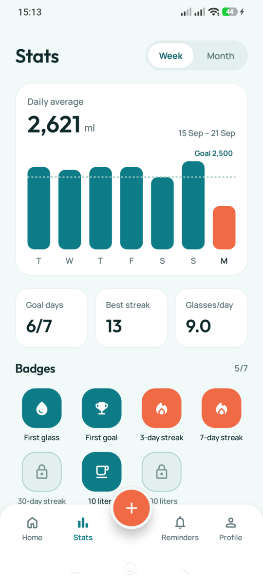<br /><sub><b>Stats · Week</b></sub></td>
    <td align="center">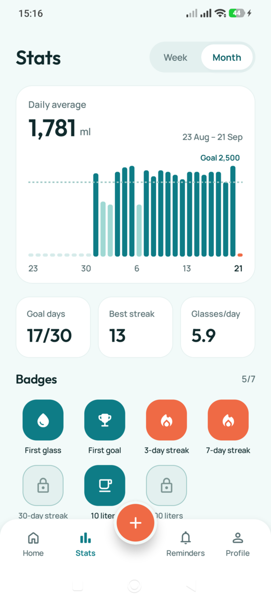<br /><sub><b>Stats · Month</b></sub></td>
  </tr>
  <tr>
    <td align="center">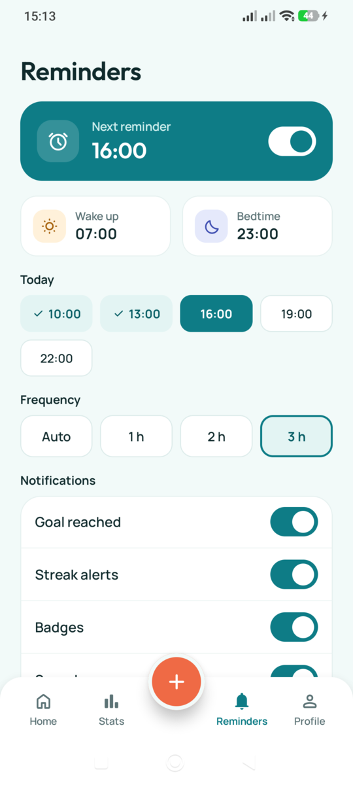<br /><sub><b>Reminders</b></sub></td>
    <td align="center">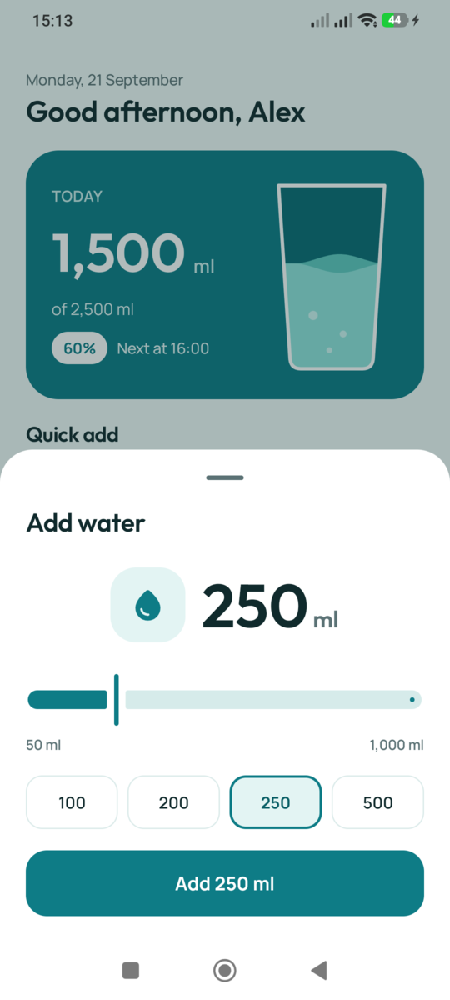<br /><sub><b>Add water</b></sub></td>
    <td align="center">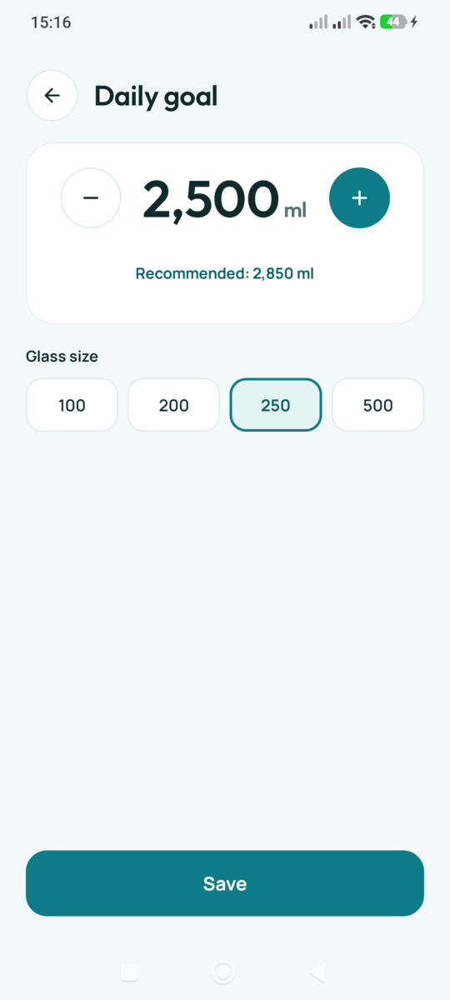<br /><sub><b>Daily goal</b></sub></td>
  </tr>
</table>

## Tech stack

| Area | Libraries |
|---|---|
| Language | [Kotlin](https://kotlinlang.org/) 2.2, [Coroutines](https://github.com/Kotlin/kotlinx.coroutines) & Flow, [kotlinx.serialization](https://github.com/Kotlin/kotlinx.serialization) |
| UI | [Jetpack Compose](https://developer.android.com/compose) (BOM 2026.02.01), Material 3, custom design system (Outfit + Manrope) |
| State management | [Orbit MVI](https://github.com/orbit-mvi/orbit-mvi) 12 |
| Navigation | [Navigation 3](https://developer.android.com/guide/navigation/navigation-3) 1.1 with a custom bottom sheet scene |
| Dependency injection | [Hilt](https://dagger.dev/hilt/) 2.60 (+ Hilt Work, Hilt Compose ViewModel) |
| Persistence | [Room](https://developer.android.com/training/data-storage/room) 2.8 (schema export + auto migrations), SharedPreferences |
| Background work | [WorkManager](https://developer.android.com/topic/libraries/architecture/workmanager) 2.11 |
| Widget | [Jetpack Glance](https://developer.android.com/develop/ui/compose/glance) 1.2 |
| Auth & monitoring | [Firebase](https://firebase.google.com/) Auth, Crashlytics, Analytics · [Credential Manager](https://developer.android.com/identity/sign-in/credential-manager) for Google sign-in |
| Images | [Coil 3](https://coil-kt.github.io/coil/) |
| Platform | Core SplashScreen, AppCompat per-app languages, Photo Picker, App Shortcuts, Quick Settings Tile |
| Build | AGP 9.3, Gradle 9.5, KSP, version catalog, core library desugaring (`java.time` on API 24) |

## Architecture

Hydro follows **Clean Architecture** with three layers and a strict dependency rule: `presenter → domain ← data`.

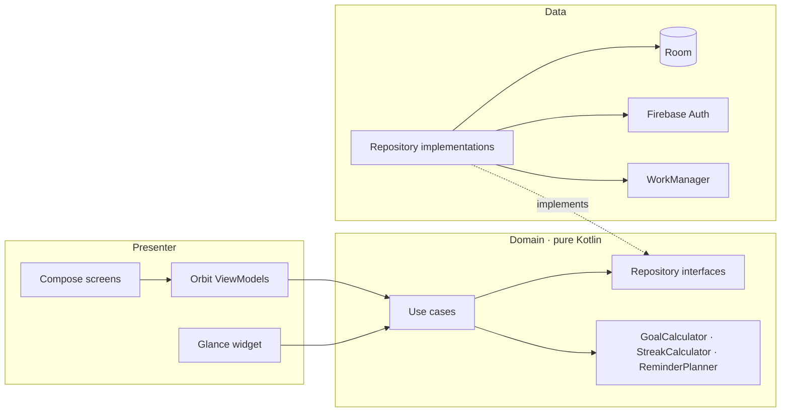

### MVI screens

Every screen uses the same four-file contract:

| File | Responsibility |
|---|---|
| `XContract` | `UiState`, `Event`, `SideEffect` and the `Direction` interface |
| `XViewModel` | An Orbit container. Handles events in `onEventDispatcher`, calls one `XUseCase` |
| `XDirection` | Translates navigation intents into `AppNavigator` calls |
| `XScreen` | A stateful entry point plus a stateless `XContent` with `@Preview`s |

The UI renders the state, sends events, and collects one-off side effects such as snackbars, the photo picker or Google sign-in.

### Navigation as an event bus

ViewModels never touch navigation APIs. They talk to a `Direction`, which forwards commands through a channel to a single Navigation 3 back stack:

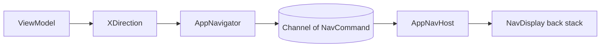

### Reminders engine

Reminders are self-rescheduling one-time WorkManager chains, so they need neither exact alarms nor a foreground service:

- `ReminderWorker` fires inside the waking window and schedules the next slot. The interval comes from the goal and cup size, or is set by the user.
- `StreakCheckWorker` warns two hours before bedtime if a streak is at risk.
- `MidnightWorker` rolls the day over and refreshes the widget.
- `TimeChangeReceiver` reschedules everything when the time or time zone changes.

## Project structure

```text
app/src/main/java/com/visionsystems/waterreminder
├── app/                 Application (Hilt, WorkManager configuration)
├── data/
│   ├── mapper/          Entity ↔ UI model mappers
│   ├── receiver/        Notification actions, time change
│   ├── repository_impl/ Repository implementations
│   ├── source/local/    Room, preferences, notifications, avatar storage
│   └── worker/          WorkManager workers and scheduler
├── di/                  Hilt modules (repositories, use cases, directions, navigation)
├── domain/
│   ├── module/          UI data models
│   ├── repository/      Repository interfaces
│   ├── usecase/         One use case per screen
│   └── util/            Pure business logic (goal, streak, reminder planning)
├── navigation/          Routes, AppNavigator, NavDisplay host, bottom sheet scene
├── presenter/
│   ├── screens/         Feature screens (Contract / ViewModel / Direction / Screen)
│   ├── start/           Splash start-destination resolver
│   └── ui/              Theme, components, formatting utilities
└── widget/              Glance widget, widget action, Quick Settings tile
```

## Getting started

### Requirements

- An Android Studio release that supports **AGP 9.3**
- **JDK 17** or newer
- A device or emulator running **Android 7.0 (API 24)** or newer

### Firebase setup

Authentication, Crashlytics and Analytics use Firebase. To build your own copy:

1. Create a Firebase project and add an Android app with the package `com.visionsystems.waterreminder`.
2. Enable **Email/Password** and **Google** in *Authentication → Sign-in method*.
3. Add your debug and release **SHA-1** fingerprints (`./gradlew signingReport`).
4. Download `google-services.json` into `app/`.

> [!NOTE]
> Google sign-in reads the `default_web_client_id` that the Google Services plugin generates. Until that exists, the app shows a friendly "not available yet" message instead of crashing.

### Build and run

```bash
git clone <repository-url>
cd WaterReminder

./gradlew installDebug      # build and install on a connected device
./gradlew assembleRelease   # release APK (configure signing first)
```

## Testing and quality

```bash
./gradlew test              # unit tests for the domain logic
./gradlew lint              # Android Lint
```

Unit tests cover the core domain logic: `GoalCalculator`, `StreakCalculator` and `ReminderPlanner` (midnight-spanning waking windows, bedtime edges, goal-reached cases).

## License

Copyright © 2026 VISION SYSTEMS CORP. All rights reserved.
